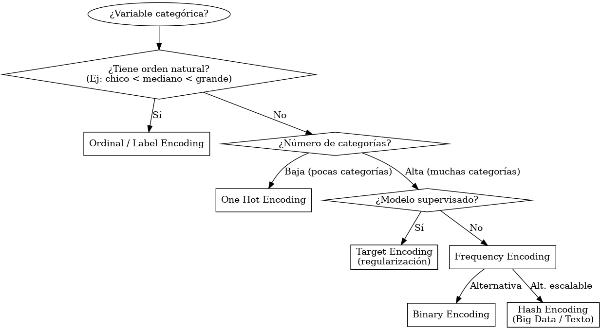

# ¿Qué es *encoding*?

En **Data Science**, *encoding* significa **transformar variables categóricas en una representación numérica** para que puedan ser utilizadas por algoritmos de Machine Learning.
Los modelos matemáticos no entienden texto o categorías directamente, por eso necesitamos representarlas con números de manera adecuada según el contexto.

## Tabla comparativa de métodos de *encoding*

| Método                              | Descripción                                                                                                 | Aplicaciones típicas                                                                         | Ventajas                                                                            | Desventajas                                                                     | Cuándo conviene usarlo                                                                          |
| ----------------------------------- | ----------------------------------------------------------------------------------------------------------- | -------------------------------------------------------------------------------------------- | ----------------------------------------------------------------------------------- | ------------------------------------------------------------------------------- | ----------------------------------------------------------------------------------------------- |
| **Label Encoding**                  | Asigna un número entero a cada categoría. Ej: `Rojo=0, Verde=1, Azul=2`.                                    | Variables categóricas ordinales (ej: nivel de educación: primaria, secundaria, universidad). | Simple, ocupa poco espacio, rápido.                                                 | Introduce orden artificial en variables nominales, lo que puede sesgar modelos. | Cuando la variable tiene un orden natural entre categorías.                                     |
| **One-Hot Encoding (OHE)**          | Crea una columna binaria por cada categoría. Ej: `Rojo=(1,0,0)`, `Verde=(0,1,0)`.                           | Variables categóricas nominales con pocas categorías.                                        | No introduce orden artificial, interpreta bien categorías independientes.           | Incrementa mucho la dimensionalidad si hay muchas categorías.                   | Cuando la variable es nominal y el número de categorías es bajo o moderado.                     |
| **Binary Encoding**                 | Convierte categorías en números y luego en su representación binaria. Ej: Cat A = 1 → 001, Cat B = 2 → 010. | Variables nominales con muchas categorías (100+).                                            | Reduce dimensionalidad respecto a OHE.                                              | Menos interpretable, puede introducir colisión de información.                  | Cuando hay muchas categorías y OHE genera demasiadas columnas.                                  |
| **Target Encoding (Mean Encoding)** | Reemplaza cada categoría por el promedio de la variable objetivo dentro de esa categoría.                   | Modelos supervisados, especialmente regresión y clasificación.                               | Captura información de la variable objetivo, mejora performance en algunos modelos. | Riesgo de *overfitting* si no se usa regularización o validación cruzada.       | Cuando hay muchas categorías y se busca mejorar performance predictiva en modelos supervisados. |
| **Frequency Encoding**              | Reemplaza categorías por su frecuencia (proporción de ocurrencia en el dataset).                            | Variables categóricas de alta cardinalidad.                                                  | Simple, mantiene cierta relación estadística.                                       | Puede perder interpretabilidad y no siempre mejora performance.                 | Útil como baseline en datasets grandes con muchas categorías.                                   |
| **Hash Encoding (Feature Hashing)** | Usa una función hash para mapear categorías a un número fijo de columnas.                                   | Procesamiento de texto, sistemas de recomendación, *big data*.                               | Escalable, controla dimensionalidad.                                                | Colisiones (distintas categorías pueden compartir el mismo hash).               | Cuando hay muchísimas categorías y se requiere eficiencia en memoria y velocidad.               |
| **Ordinal Encoding**                | Similar al Label Encoding, pero el orden se define manualmente por el analista.                             | Variables ordinales claras (ej: tamaño: chico < mediano < grande).                           | Representa correctamente la jerarquía.                                              | Incorrecto si se usa en variables sin orden natural.                            | Cuando la variable tiene jerarquía definida y conocida.                                         |

---

## Resumen de uso recomendado

* **Orden natural (ej: niveles de estudio, talles de ropa):** Ordinal Encoding / Label Encoding.
* **Pocas categorías nominales (ej: colores, país con 5 opciones):** One-Hot Encoding.
* **Muchas categorías nominales (ej: código postal, producto ID):** Binary Encoding o Frequency Encoding.
* **Muy alta cardinalidad (ej: millones de palabras, logs):** Hash Encoding.
* **Modelos supervisados y se quiere mejorar predicción:** Target Encoding (con regularización).

# Arbol Encoding


Excelente pedido, Andru. Te preparo primero una breve **explicación de qué es encoding** y después te doy un **ejemplo claro de cada tipo de encoding** aplicado a una misma variable para que se vea la diferencia.

---


Ejemplo:
Supongamos la variable **Color** con valores:

```python
["Rojo", "Verde", "Azul", "Rojo", "Azul"]
```

---

## Ejemplos de cada método de *encoding*

### 1. **Label Encoding**

Convierte cada categoría en un número entero.

```python
Rojo=0, Verde=1, Azul=2
["Rojo", "Verde", "Azul", "Rojo", "Azul"] → [0, 1, 2, 0, 2]
```

✔ Útil para variables **ordinales** (ej: nivel educativo).
✘ Puede introducir orden artificial si la variable es **nominal**.

---

### 2. **One-Hot Encoding**

Crea una columna binaria para cada categoría.

```python
Color_Rojo | Color_Verde | Color_Azul
     1     |      0      |     0
     0     |      1      |     0
     0     |      0      |     1
     1     |      0      |     0
     0     |      0      |     1
```

✔ No introduce orden artificial.
✘ Aumenta mucho la dimensionalidad si hay muchas categorías.

---

### 3. **Binary Encoding**

Convierte las categorías en números y luego en binario.

```python
Rojo=1 → 01  
Verde=2 → 10  
Azul=3 → 11  

["Rojo", "Verde", "Azul", "Rojo", "Azul"] → [[0,1],[1,0],[1,1],[0,1],[1,1]]
```

✔ Útil con muchas categorías.
✘ Menos interpretable.

---

### 4. **Target Encoding (Mean Encoding)**

Usa la media de la variable objetivo para cada categoría.
Ejemplo: queremos predecir si el cliente compra (1) o no (0).

Datos:

```python
Rojo → [1, 0, 1] → promedio = 0.67
Verde → [0, 1] → promedio = 0.50
Azul → [1, 1] → promedio = 1.00
```

Transformación:

```python
["Rojo", "Verde", "Azul", "Rojo", "Azul"] → [0.67, 0.5, 1.0, 0.67, 1.0]
```

✔ Muy útil para mejorar performance predictiva.
✘ Riesgo de *overfitting* si no se regulariza.

---

### 5. **Frequency Encoding**

Reemplaza cada categoría por su frecuencia de aparición.

Datos:

```
Rojo = 2/5 = 0.40  
Verde = 1/5 = 0.20  
Azul = 2/5 = 0.40
```

Transformación:

```python
["Rojo", "Verde", "Azul", "Rojo", "Azul"] → [0.40, 0.20, 0.40, 0.40, 0.40]
```

✔ Útil con alta cardinalidad.
✘ Puede perder interpretabilidad.

---

### 6. **Hash Encoding (Feature Hashing)**

Usa una función hash para mapear categorías a un número fijo de columnas.

Ejemplo con 3 columnas de hash:

```
Rojo → [1,0,0]  
Verde → [0,1,0]  
Azul → [0,0,1]
```

(Con más categorías, algunas colisiones pueden ocurrir).
✔ Escalable para millones de categorías.
✘ Posibles colisiones de categorías distintas en el mismo hash.

---

### 7. **Ordinal Encoding**

Se asigna un número siguiendo un orden definido **por el analista**.
Ejemplo: supongamos que el orden es `Rojo < Verde < Azul`.

```python
Rojo=1, Verde=2, Azul=3
["Rojo", "Verde", "Azul", "Rojo", "Azul"] → [1, 2, 3, 1, 3]
```

✔ Correcto para variables con jerarquía natural.
✘ Incorrecto para categorías sin orden.
